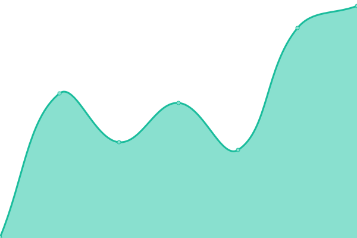

# [📈 Live Status](https://spielers.github.io/hostics): <!--live status--> **🟧 Partial outage**

This repository contains the open-source uptime monitor and status page for [Suraj Patil](www.surajpatil.tech), powered by [Upptime](https://github.com/upptime/upptime).

With [Upptime](https://upptime.js.org), you can get your own unlimited and free uptime monitor and status page, powered entirely by a GitHub repository. We use [Issues](https://github.com/spielers/hostics/issues) as incident reports, [Actions](https://github.com/spielers/hostics/actions) as uptime monitors, and [Pages](https://spielers.github.io/hostics) for the status page.

<!--start: status pages-->
<!-- This summary is generated by Upptime (https://github.com/upptime/upptime) -->
<!-- Do not edit this manually, your changes will be overwritten -->
<!-- prettier-ignore -->
| URL | Status | History | Response Time | Uptime |
| --- | ------ | ------- | ------------- | ------ |
|  [Gamitics](https://gamitics.com/) | 🟩 Up | [gamitics.yml](https://github.com/spielers/hostics/commits/HEAD/history/gamitics.yml) | 

 1967ms
     
 | 

<a href="https://spielers.github.io/hostics/history/gamitics">100.00%</a>
    

|  [surajpatil.tech](http://surajpatil.tech/) | 🟥 Down | [surajpatil-tech.yml](https://github.com/spielers/hostics/commits/HEAD/history/surajpatil-tech.yml) | 

 0ms
     
 | 

<a href="https://spielers.github.io/hostics/history/surajpatil-tech">100.00%</a>
    

|  [businessengineer.in](http://businessengineer.in) | 🟩 Up | [businessengineer-in.yml](https://github.com/spielers/hostics/commits/HEAD/history/businessengineer-in.yml) | 

 308ms
     
 | 

<a href="https://spielers.github.io/hostics/history/businessengineer-in">0.00%</a>
    

|  [impulse-e-education.site](https://impulse-e-education.site) | 🟥 Down | [impulse-e-education-site.yml](https://github.com/spielers/hostics/commits/HEAD/history/impulse-e-education-site.yml) | 

 0ms
     
 | 

<a href="https://spielers.github.io/hostics/history/impulse-e-education-site">100.00%</a>
    

|  [kccbls.tech](https://kccbls.tech) | 🟥 Down | [kccbls-tech.yml](https://github.com/spielers/hostics/commits/HEAD/history/kccbls-tech.yml) | 

 0ms
     
 | 

<a href="https://spielers.github.io/hostics/history/kccbls-tech">100.00%</a>
    

|  [impulse-e-education.site](https://impulse-e-education.site) | 🟥 Down | [impulse-e-education-site.yml](https://github.com/spielers/hostics/commits/HEAD/history/impulse-e-education-site.yml) | 

 0ms
     
 | 

<a href="https://spielers.github.io/hostics/history/impulse-e-education-site">100.00%</a>
    

|  [guruashramfaculty.in](https://guruashramfaculty.in) | 🟩 Up | [guruashramfaculty-in.yml](https://github.com/spielers/hostics/commits/HEAD/history/guruashramfaculty-in.yml) | 

 1877ms
     
 | 

<a href="https://spielers.github.io/hostics/history/guruashramfaculty-in">100.00%</a>
    

|  [graphicxpress.in](http://graphicxpress.in/) | 🟩 Up | [graphicxpress-in.yml](https://github.com/spielers/hostics/commits/HEAD/history/graphicxpress-in.yml) | 

 363ms
     
 | 

<a href="https://spielers.github.io/hostics/history/graphicxpress-in">0.00%</a>
    

|  [Aimetix.com](https://aimetix.com) | 🟥 Down | [aimetix-com.yml](https://github.com/spielers/hostics/commits/HEAD/history/aimetix-com.yml) | 

 8135ms
     
 | 

<a href="https://spielers.github.io/hostics/history/aimetix-com">100.00%</a>
    

|  [Acmeera.com](https://acmeera.com) | 🟩 Up | [acmeera-com.yml](https://github.com/spielers/hostics/commits/HEAD/history/acmeera-com.yml) | 

 923ms
     
 | 

<a href="https://spielers.github.io/hostics/history/acmeera-com">100.00%</a>
    

|  [longhorns.in](https://longhorns.in) | 🟥 Down | [longhorns-in.yml](https://github.com/spielers/hostics/commits/HEAD/history/longhorns-in.yml) | 

 201ms
     
 | 

<a href="https://spielers.github.io/hostics/history/longhorns-in">100.00%</a>
    

|  [Aimetix.com](https://aimetix.com) | 🟥 Down | [aimetix-com.yml](https://github.com/spielers/hostics/commits/HEAD/history/aimetix-com.yml) | 

 8135ms
     
 | 

<a href="https://spielers.github.io/hostics/history/aimetix-com">100.00%</a>
    

|  [harekrishnaredevelopers.site](https://harekrishnaredevelopers.site) | 🟥 Down | [harekrishnaredevelopers-site.yml](https://github.com/spielers/hostics/commits/HEAD/history/harekrishnaredevelopers-site.yml) | 

 0ms
     
 | 

<a href="https://spielers.github.io/hostics/history/harekrishnaredevelopers-site">100.00%</a>
    

|  [sonecacolabeach.com](https://sonecacolabeach.com) | 🟩 Up | [sonecacolabeach-com.yml](https://github.com/spielers/hostics/commits/HEAD/history/sonecacolabeach-com.yml) | 

 528ms
     
 | 

    

|  [Test for HEAD](https://www.google.com) | 🟩 Up | [test-for-head.yml](https://github.com/spielers/hostics/commits/HEAD/history/test-for-head.yml) | 

 97ms
     
 | 

<a href="https://spielers.github.io/hostics/history/test-for-head">100.00%</a>
    

|  [TCP ping](1.1.1.1) | 🟩 Up | [tcp-ping.yml](https://github.com/spielers/hostics/commits/HEAD/history/tcp-ping.yml) | 

 68ms
     
 | 

<a href="https://spielers.github.io/hostics/history/tcp-ping">100.00%</a>
    

<!--end: status pages-->

[**Visit our status website →**](https://spielers.github.io/hostics)

## 📄 License

- Powered by: [Upptime](https://github.com/upptime/upptime)
- Code: [MIT](./LICENSE) © [Suraj Patil](www.surajpatil.tech)
- Data in the `./history` directory: [Open Database License](https://opendatacommons.org/licenses/odbl/1-0/)
